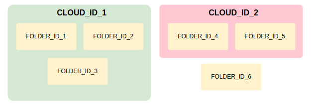

# INT-11-Лавренов_Дмитрий

## Инструкция по запуску 

Проект запускается с помощью `docker compose up` из коневой дирректории проекта `'Yandex-Cloud-PT-INT-11'`

Для демонстрации сервис запускается сразу после старта контейнера, далее с помощью `cron`
каждую минуту (cron работает в самом контейнере).  
Файл с расписанием - `crontab` в корневой дирректории проекта.

Перед запуском нужно создать в корневой директории файл c именем `.env`. Пример того, как он должен выглядеть 
`example.env` в корневой дирректории проекта

```dotenv
TZ_DOCKER=Europe/Moscow
TIME_ZONE_PROGRAM="Russian Standard Time"
OAUTH_TOKEN=YOUR_OAUTH_TOKEN
CLOUD_ID_1=YOUR_CLOUD_ID_1
CLOUD_ID_2=YOUR_CLOUD_ID_2
...
CLOUD_ID_N=YOUR_CLOUD_ID_N
FOLDER_ID_1=YOUR_FOLDER_ID_1
FOLDER_ID_2=YOUR_FOLDER_ID_2
...
FOLDER_ID_N=YOUR_FOLDER_ID_N
```

**В конечном итоге он должен выглядеть примерно так:**
```dotenv
TZ_DOCKER=Europe/Moscow
TIME_ZONE_PROGRAM="Russian Standard Time"
OAUTH_TOKEN=YOUR_OAUTH_TOKEN
CLOUD_ID_1=YOUR_CLOUD_ID_1
CLOUD_ID_2=YOUR_CLOUD_ID_2
FOLDER_ID_1=YOUR_FOLDER_ID_1
FOLDER_ID_2=YOUR_FOLDER_ID_2
FOLDER_ID_3=YOUR_FOLDER_ID_3
```

Где:
- `TZ_DOCKER` - часовой пояс в контейнере (его использует cron) для этого используется пакет `tzdata`.
Указывать опционально (по умолчанию значение будет UTC) используя формат `TZ identifier` из таблицы:
https://en.wikipedia.org/wiki/List_of_tz_database_time_zones.
- `TIME_ZONE_PROGRAM` - часовой пояс для самого сервиса (важно для проверки `expired_date`).
  Указывать опционально (по умолчанию будет UTC) в формате `ICU`. Список возможных значений:
  https://docs.oracle.com/cd/E87306_01/DR/ICU_Time_Zones.html
- `OAUTH_TOKEN` - OAuth-токен из Yandex Cloud. Указывать тот, под чьим аккаунтом
используется облако, на котором будут проверки меток. Документация по его получению: 
https://yandex.cloud/ru/docs/iam/concepts/authorization/oauth-token
- `CLOUD_ID_1` - На фото ниже - красный квадрат. ID облаков, на которых будут проверки. Указывать можно
несколько, цифра у переменной не принципиальна, можно указать и другой суффикс после `_`, главное не повторять имена переменных.
- `FOLDER_ID_1` - На фото ниже - синие квадраты. ID каталогов, на которых будут проверки. Указывать
можно также, как и предыдущие переменные. 
**Важно см. последнее фото. Указанные папки должны быть в указанных облаках, иначе они не проверятся**


Для примера, в `.env` были указаны все эти значения. Все папки, кроме `FOLDER_ID_6`,
будут проверены, поскольку для них указаны соответствующие `CLOUD_ID_`

